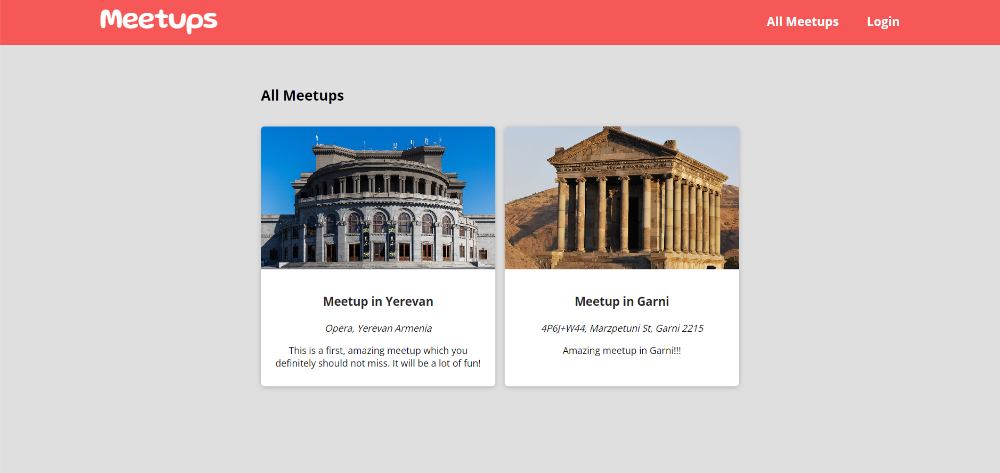
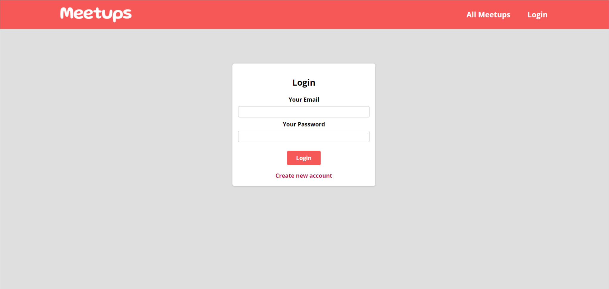
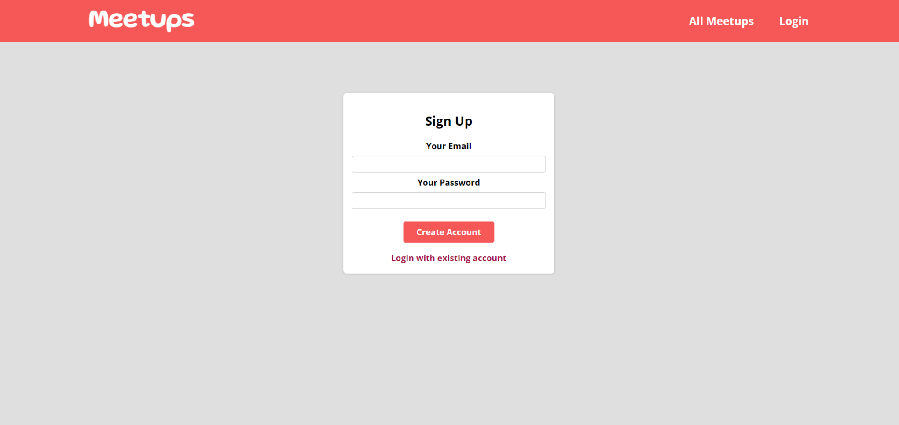
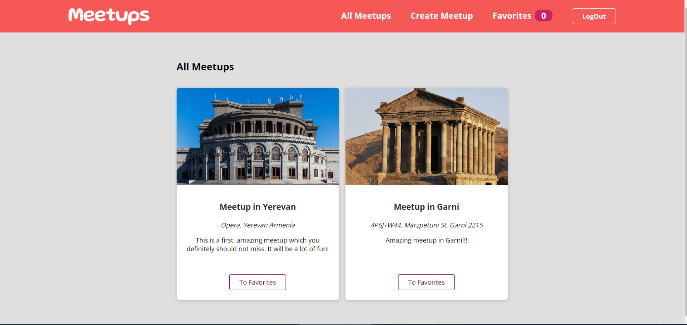
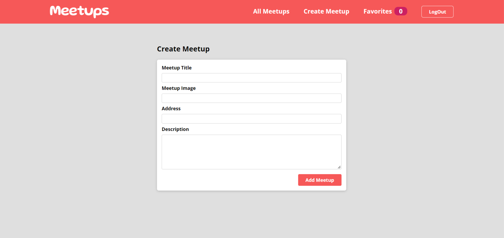
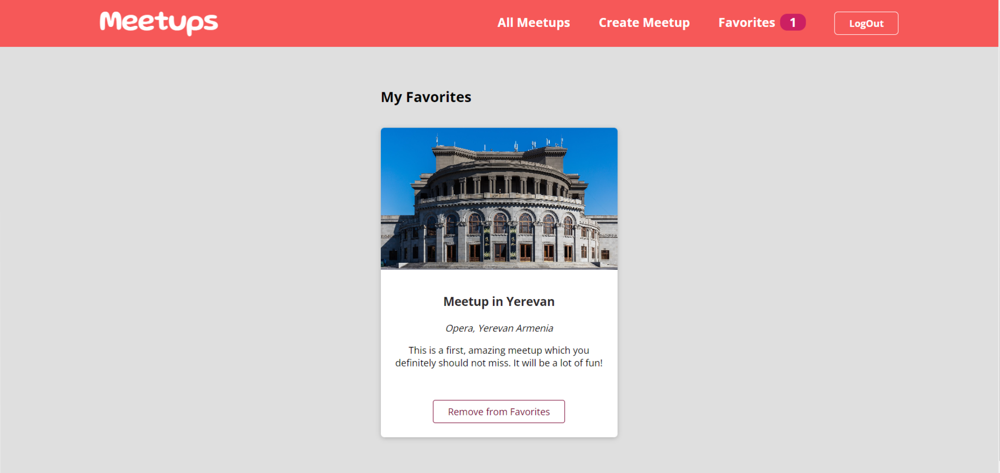

# Meetup application

### ScreenShots

---

### Installation and Setup Instructions

---

Clone down this repository. You will need node and npm installed globally on your machine.

Installation:

`npm install`

To Start Server:

`npm start`

To Visit App:

`localhost:3000`
